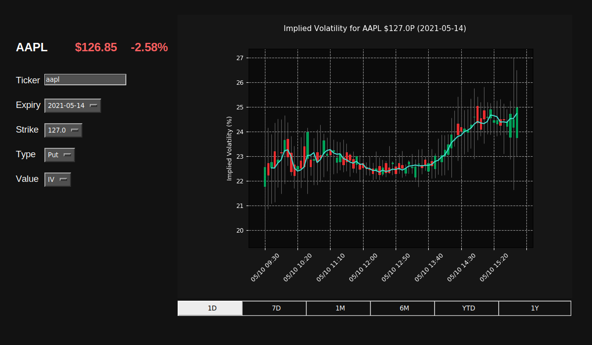
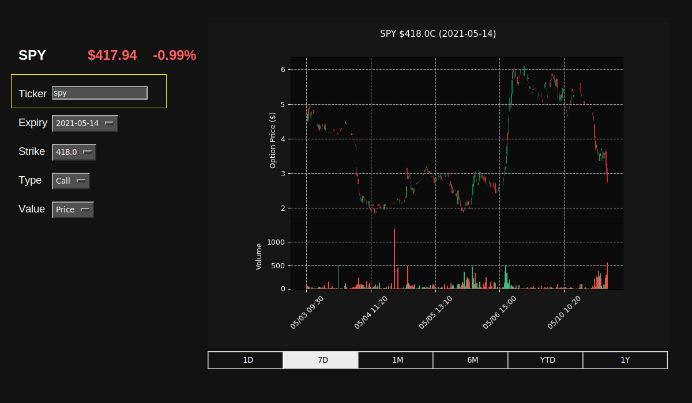
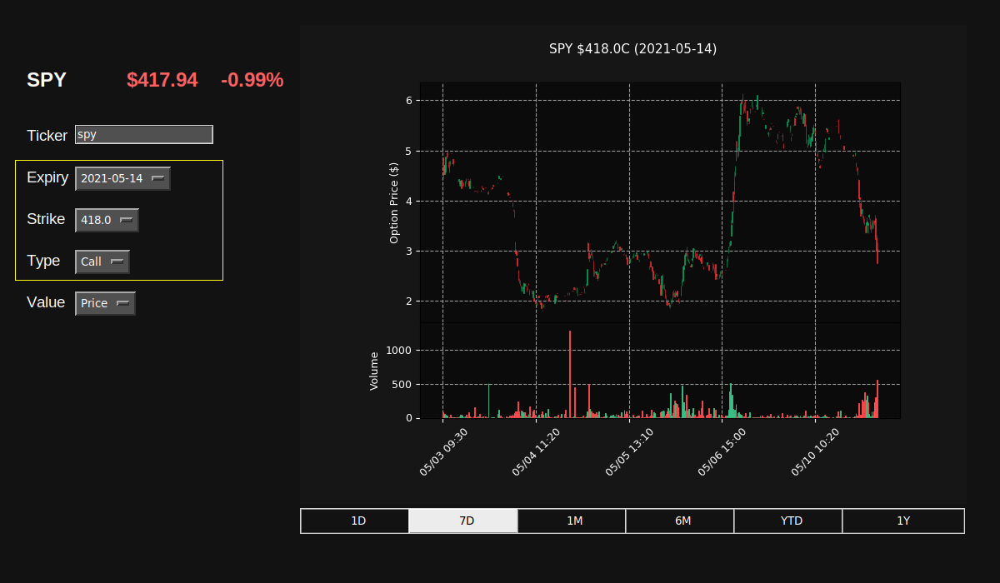
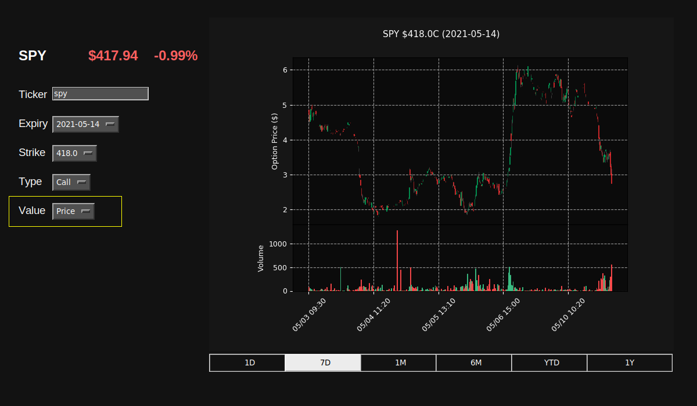

# Extention of MySybil's Historic Options Data Plotter: Faster computations, implementation of Greeks, and updated UI



This set of scripts aims to provide free access to historic options trade data for anyone that wants it. Whether you want to simply quickly view trade history, or if you want to use these scripts as a starting point to build from, the main hope is to save you time and provide you a small amount of independence from your broker and any websites trying to make money off of you.

The scripts are plug-and-play from a Python3 CLI, but if you decide to use them on an ongoing basis then you should create your own account at developer.tradier.com and generate your own API token in order to alleviate any potential strain on the communal key provided. It's free, it only takes 30 seconds, and you'll never have to worry about fighting with other users around rate-limiting. 

## Getting Started

These instructions will get you a copy of the project up and running on your local machine.

### Dependencies
```
matplotlib
numpy
pandas
requests
scipy
trading_calendars
tkinter
python-dev
```

Note: this package is currently running a custom version of mplfinance with additional personalization options for plots. 

In this extention, I made a custom library in C that is used for the volatility computations. To install this library, navigate to /black_scholes_c_lib and run the command:

```
python3 setup.py install
```
This has currently only been tested on Ubuntu 16.04. Installation may be different on other operating systems. If the above command doesn't work, you can try

```
python3 setup.py build
```

and move the created .so file to the root directory.


### Run Example

To run:

```
python3 main.py
```

As a quick example, run the script and input a ticker in the "ticker" box. In this case, we will input SPY

Here, you enter the ticker then click enter.



You can then select the option specifications you desire.



Here, you can select what you want to plot. The options include price, IV, and the Greeks.



The program should download all the data and then display a candlestick chart of the trade data after each change you make to the specifications.

* Note: the Implied Volatility data that is printed is the 'close' data point. See the note below. 

### Implied Volatility

So what's the deal with the volatility charts? What it comes down to is that to calculate the volatility at the time of the trade you need to know the current price of the underlying stock as well. The data that these scripts get from Tradier is the opening, closing, lowest, and highest price for an option (or stock) during a time period. Since options have inconsistent volume we can't determine when during that period any of the trades took place, so there's going inaccuracy in any volatility that gets calculate. This inaccuracy is small for data with a small interval size, but if we look at daily data for a low volume option then the calculations become unreliable.

To account for this, the script calculates four volatility values for every interval: the opening value (for daily data this would assume that the first option trade is at 9:30 AM), the closing value (this would assume the last option trade is at 4:00 PM), the highest possible volatility, and the lowest possible volatility value. The script then displays this in candles using a traditional OHLC framework. For one-minute intervals the wicks are very small, for daily intervals they are very large. 

**The wick DOES NOT imply that the there was a trade with that implied volatility - only that it is possible that there COULD HAVE BEEN.**

SQQQ Volatility over the past week: 


## Additional Notes

There is an API key hard-coded into the script and it's totally cool for you to use this while deciding if you want to continue to use this script or not, but there is rate-limiting on it and the potential for that to become a problem. If you do plan to use this script frequently or build on-top of it, please head over to developer.tradier.com and sign up for free for an account and get your own API key.

The mplfinance library is still under development and not-totally stable. I run into issues like having to change the window size of the plots manually to get them to auto-resize.

## Authors

* **MySybil.com**
* **Justin Lee**  

## Acknowledgments

* I would like to thank Tradier for providing free access to their sandbox API to get free historic options quotes.
